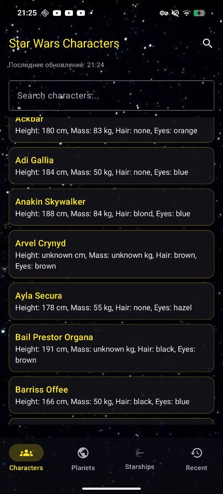
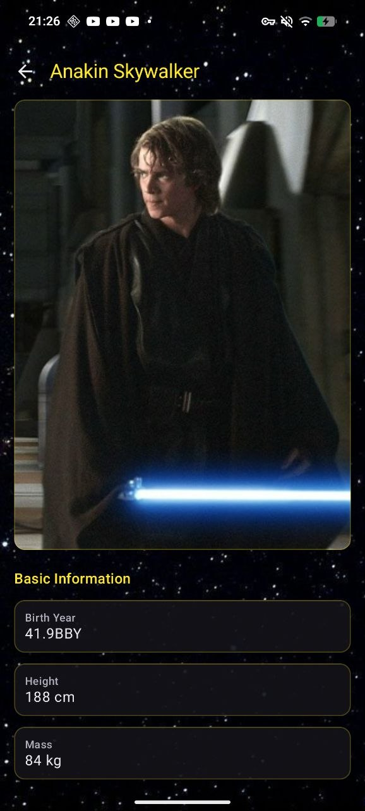
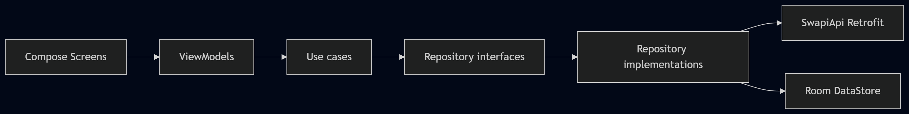

# TestTask — Tg: https://t.me/Nikita_Strelkov_Clover

Android-приложение на Kotlin для работы с публичным API [SWAPI](https://swapi.dev): каталоги персонажей, планет и звёздных кораблей, экраны деталей, поиск и кэширование для работы без сети.

Реализована единая тема в духе Star Wars на Jetpack Compose. Функциональные требования ТЗ при этом соблюдены.

---

## Скриншоты и демонстрации

Статические кадры и ролики лежат в [`app/src/main/res/drawable/`](app/src/main/res/drawable/).

Экран списка персонажей:

Экран деталей персонажа:

---

## Соответствие требованиям

| Требование | Реализация |
|------------|------------|
| API `swapi.dev` | Базовый URL и методы в [`SwapiApi.kt`](app/src/main/java/com/example/testtask/data/remote/SwapiApi.kt); Retrofit; десериализация через Kotlin Serialization. |
| Первый экран — персонажи | `NavHost` в [`AppNavGraph.kt`](app/src/main/java/com/example/testtask/presentation/navigation/AppNavGraph.kt) стартует с маршрута персонажей. Перед основным графом при первом запуске показывается онбординг ([`RootNav.kt`](app/src/main/java/com/example/testtask/presentation/navigation/RootNav.kt), [`RootViewModel.kt`](app/src/main/java/com/example/testtask/presentation/navigation/RootViewModel.kt)). |
| Кэш и офлайн | Локальное хранение в Room ([`AppDatabase.kt`](app/src/main/java/com/example/testtask/data/local/AppDatabase.kt), DAO по сущностям). Репозитории записывают ответы сети в БД; UI подписан на `Flow`. Метаданные синхронизации — [`SyncMetadataDao.kt`](app/src/main/java/com/example/testtask/data/local/dao/SyncMetadataDao.kt) и обновления в реализациях репозиториев. При отсутствии сети отображаются последние закэшированные данные. |
| Назад на всех экранах, кроме главного | На экранах деталей и глобального поиска — кнопка «Назад» в верхней панели и `NavController.popBackStack()`. Корневые вкладки (персонажи, планеты, корабли, недавние) стрелки «Назад» не показывают. |
| Пустые данные | Для пустых списков, отсутствия записей в кэше и отдельных полей деталей выводятся явные сообщения (строковые ресурсы в `app/src/main/res/values/strings.xml`). |
| Индикатор загрузки | На списках и при локальном поиске используются индикаторы загрузки в состоянии UI. Для глобального поиска при активном запросе показывается полноэкранная dotLottie-анимация ([`GlobalSearchScreen.kt`](app/src/main/java/com/example/testtask/presentation/search/GlobalSearchScreen.kt)). |
| Три слоя и DI | Пакеты `data`, `domain`, `presentation`. Внедрение зависимостей — Hilt, модули в [`di/`](app/src/main/java/com/example/testtask/di/). |

---

## Архитектура

- **Domain** — модели предметной области, контракты репозиториев, use case: обновление списков и деталей, поиск, недавние просмотры, онбординг и др.
- **Data** — DTO, маппинг в сущности/модели, [`SwapiApi`](app/src/main/java/com/example/testtask/data/remote/SwapiApi.kt), реализации репозиториев, Room, DataStore (флаг прохождения стартового экрана с каруселью). Общие примитивы сети: повтор запросов с экспоненциальной задержкой [`retryWithBackoff`](app/src/main/java/com/example/testtask/data/repository/RepositorySyncUtils.kt), политика TTL списков [`CachePolicy`](app/src/main/java/com/example/testtask/data/repository/RepositorySyncUtils.kt).
- **Presentation** — экраны Compose, `ViewModel`, навигация (`AppNavGraph`, `RootNav`).

Схема слоёв (исходный файл [`diagram.png`](app/src/main/res/drawable/diagram.png)):

---

## Глобальный поиск и сортировка результатов

SWAPI отдаёт результаты **по типу ресурса** отдельными запросами (`people`, `planets`, `starships` с параметром `search`). Сервис **не гарантирует** единую сквозную сортировку «лучший матч сверху» между персонажами, планетами и кораблями.

Принятое решение ([`GlobalSearchViewModel.kt`](app/src/main/java/com/example/testtask/presentation/search/GlobalSearchViewModel.kt)):

1. После debounce (**400 ms**) запускаются **три параллельных** запроса через `async` в одном `coroutineScope`.
2. Ответы преобразуются в обобщённый список [`GlobalSearchItem`](app/src/main/java/com/example/testtask/presentation/search/GlobalSearchUiState.kt) (тип сущности, `id`, заголовок для отображения).
3. Плоский список **сортируется на клиенте** функцией [`sortedBySearchRelevance`](app/src/main/java/com/example/testtask/presentation/search/GlobalSearchRelevance.kt), которая опирается на числовой скоринг [`globalSearchRelevanceScore`](app/src/main/java/com/example/testtask/presentation/search/GlobalSearchRelevance.kt) по строке **имени** (`title`) и введённому запросу (без учёта регистра).

Правила скоринга (чем выше значение, тем выше строка в списке):

- **Префикс всей строки** имени совпадает с запросом — наивысший уровень (плюс небольшой бонус за длину запроса).
- Иначе **префикс одного из слов** имени (слова выделяются разделителями, в т.ч. небуквенно-цифровые символы) — средний уровень; чем левее слово в имени, тем выше приоритет.
- Иначе **вхождение подстроки** — более низкий уровень; учитываются позиция первого вхождения и число вхождений.
- При равенстве скора порядок стабилизируется **лексикографически** по `title`.

Таким образом порядок в UI отражает релевантность **относительно введённой строки**, а не порядок ответа API. Поведение покрыто тестами [`GlobalSearchRelevanceTest.kt`](app/src/test/java/com/example/testtask/presentation/search/GlobalSearchRelevanceTest.kt).

---

## Локальные портреты персонажей

SWAPI не содержит полей с URL изображений. Для части персонажей в проект добавлены растровые ресурсы (drawable), сопоставляемые **в коде** с записью SWAPI.

Расширение [`CharacterDetails.localHeroDrawableRes()`](app/src/main/java/com/example/testtask/presentation/details/CharacterLocalAssets.kt) для модели [`CharacterDetails`](app/src/main/java/com/example/testtask/domain/model/CharacterDetails.kt):

1. **Сначала** проверяется числовой **`id`** персонажа (как в API), для известных значений возвращается конкретный `R.drawable.*`.
2. **Иначе** имя приводится к нижнему регистру и сопоставляется **по подстрокам** , чтобы подобрать тот же drawable, если `id` в теории изменится или сработает другая выборка.

Таблица явных соответствий по `id` в коде:

| ID (SWAPI) | Ресурс drawable | Персонаж (ориентир) |
|------------|-----------------|----------------------|
| 2 | `c3po` | C-3PO |
| 10 | `obi_wan_kenobi` | Obi-Wan Kenobi |
| 11 | `anakin_skywalker` | Anakin Skywalker |
| 22 | `boba_fett` | Boba Fett |
| 27 | `ackbar` | Ackbar |

На экране [`CharacterDetailsScreen.kt`](app/src/main/java/com/example/testtask/presentation/details/CharacterDetailsScreen.kt) вызывается `details.localHeroDrawableRes()`: если значение не `null`, поверх списка карточек показывается локальный портрет через `painterResource(resId)`; если `null`, блок с изображением не строится.

---

## Сеть, офлайн и сообщения пользователю

Мониторинг доступности сети: [`NetworkMonitor`](app/src/main/java/com/example/testtask/presentation/util/NetworkMonitor.kt) реализует [`NetworkStatusProvider`](app/src/main/java/com/example/testtask/presentation/util/NetworkStatusProvider.kt) на базе `ConnectivityManager` и колбэков/капабилити; во `Flow` пробрасывается признак **онлайн/офлайн**, на который подписываются `ViewModel` вкладок списков.

На примере персонажей ([`CharactersViewModel.kt`](app/src/main/java/com/example/testtask/presentation/characters/CharactersViewModel.kt), [`CharactersScreen.kt`](app/src/main/java/com/example/testtask/presentation/characters/CharactersScreen.kt)):

- При потере сети обновление с сервера **не выполняется** (pull-to-refresh и догрузка страниц учитывают `isOnline`); пользователь продолжает видеть **данные из Room**.
- Текстовые уведомления выводятся в **`AnimatedVisibility`** над списком через общий компонент [`InfoBanner`](app/src/main/java/com/example/testtask/presentation/common/ListUiComponents.kt) (локальный `OfflineBanner` — простая обёртка). В состояние попадают строки из [`strings.xml`](app/src/main/res/values/strings.xml), например: «Оффлайн: показаны сохранённые данные», «Не удалось обновить данные. Показан кеш.», «Снова в сети…», «Данные обновлены» и тд.
- Логика смены баннеров и стабилизации после кратковременных обрывов вынесена в [`NetworkRecoveryStateMachine`](app/src/main/java/com/example/testtask/presentation/characters/NetworkRecoveryStateMachine.kt); **аналогичный паттерн** используется для планет и кораблей ([`PlanetsViewModel.kt`](app/src/main/java/com/example/testtask/presentation/planets/PlanetsViewModel.kt), [`StarshipsViewModel.kt`](app/src/main/java/com/example/testtask/presentation/starships/StarshipsViewModel.kt)).

Демонстрация поведения при отключении сети: [internet_connection_info.mp4](app/src/main/res/drawable/internet_connection_info.mp4).

---

## Расширения относительно минимального задания

- **Разделы** — помимо персонажей: планеты и звёздные корабли; нижняя навигация в [`AppNavGraph.kt`](app/src/main/java/com/example/testtask/presentation/navigation/AppNavGraph.kt). Четвёртая вкладка — **Недавние** ([`RecentViewsScreen.kt`](app/src/main/java/com/example/testtask/presentation/recent/RecentViewsScreen.kt), [`RecentViewsRepositoryImpl.kt`](app/src/main/java/com/example/testtask/data/repository/RecentViewsRepositoryImpl.kt)).
- **Глобальный поиск** — отдельный маршрут из панели действий; параллельные запросы, клиентская сортировка релевантности (см. раздел выше), экран [`GlobalSearchScreen.kt`](app/src/main/java/com/example/testtask/presentation/search/GlobalSearchScreen.kt).
- **Поиск на экранах списков** — параметр `search` у постраничных эндпоинтов SWAPI; объединение с данными из локального кэша в соответствующих `ViewModel`.
- **Онбординг** — многостраничный экран при первом запуске; состояние в DataStore ([`OnboardingRepository.kt`](app/src/main/java/com/example/testtask/domain/repository/OnboardingRepository.kt), [`OnboardingRepositoryImpl.kt`](app/src/main/java/com/example/testtask/data/repository/OnboardingRepositoryImpl.kt)); иллюстрации — SVG в `app/src/main/assets/onboarding/`.
- **Интерфейс** — общий фон [`StarfieldBackground`](app/src/main/java/com/example/testtask/presentation/common/StarfieldBackground.kt), карточки [`StarWarsCard`](app/src/main/java/com/example/testtask/presentation/common/ListUiComponents.kt), прозрачные `Scaffold` / панели для сохранения фона.

---

## Стек технологий

Kotlin, Jetpack Compose, Material 3, Navigation Compose, Lifecycle ViewModel, Coroutines, Flow.

Hilt, KSP, Room, DataStore Preferences, Retrofit, OkHttp, kotlinx.serialization.

Загрузка изображений: Coil (в том числе SVG для онбординга). Анимация загрузки глобального поиска: библиотека dotLottie Android (артефакт через JitPack, репозиторий подключён в [`settings.gradle.kts`](settings.gradle.kts)).

Актуальные версии зависимостей: [`gradle/libs.versions.toml`](gradle/libs.versions.toml), подключение модулей: [`app/build.gradle.kts`](app/build.gradle.kts).

---

## Сборка и запуск

- **Среда**: Android Studio с поддержкой проекта на AGP/Kotlin из каталога версий; JDK 11 (см. `compileOptions` / `kotlinOptions` в [`app/build.gradle.kts`](app/build.gradle.kts)).
- **Целевые уровни**: `minSdk` 24, `targetSdk` 36, `compileSdk` 36.
- **Разрешения**: `INTERNET`, `ACCESS_NETWORK_STATE` — [`AndroidManifest.xml`](app/src/main/AndroidManifest.xml).

---

## Тестирование

Юнит-тесты (JUnit, при необходимости kotlinx-coroutines-test), в том числе:

- [`GlobalSearchRelevanceTest.kt`](app/src/test/java/com/example/testtask/presentation/search/GlobalSearchRelevanceTest.kt)
- [`CharactersViewModelTest.kt`](app/src/test/java/com/example/testtask/presentation/characters/CharactersViewModelTest.kt)
- репозитории: [`PeopleRepositoryImplTest.kt`](app/src/test/java/com/example/testtask/data/repository/PeopleRepositoryImplTest.kt), [`PlanetsRepositoryImplTest.kt`](app/src/test/java/com/example/testtask/data/repository/PlanetsRepositoryImplTest.kt), [`StarshipsRepositoryImplTest.kt`](app/src/test/java/com/example/testtask/data/repository/StarshipsRepositoryImplTest.kt)
- прочие: use case, мапперы, онбординг — в каталоге [`app/src/test/java/com/example/testtask/`](app/src/test/java/com/example/testtask/)

Запуск юнит-тестов: `gradlew.bat testDebugUnitTest` (или `./gradlew testDebugUnitTest`).

---

## Ограничения

- SWAPI предоставляет только структурированные текстовые данные и ссылки на другие ресурсы API; изображения персонажей в API отсутствуют, локальные иллюстрации используются точечно (см. раздел про портреты).
- Анимация dotLottie для глобального поиска загружается по HTTPS с внешнего URL; при первом показе требуется сеть до кэширования на стороне библиотеки/системы.
- Тяжёлые файлы (`*.mp4`, крупные изображения) в `drawable/` увеличивают размер APK; при необходимости их можно перенести в другое место (например, `raw/`) или исключить из поставки и хранить только в документации репозитория.
